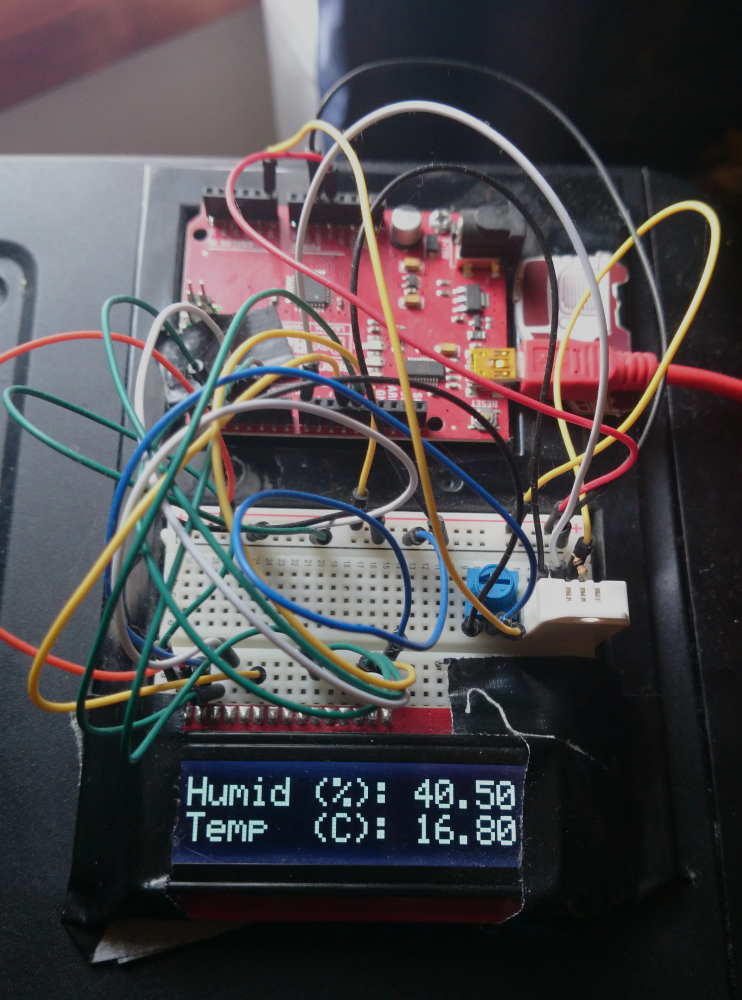
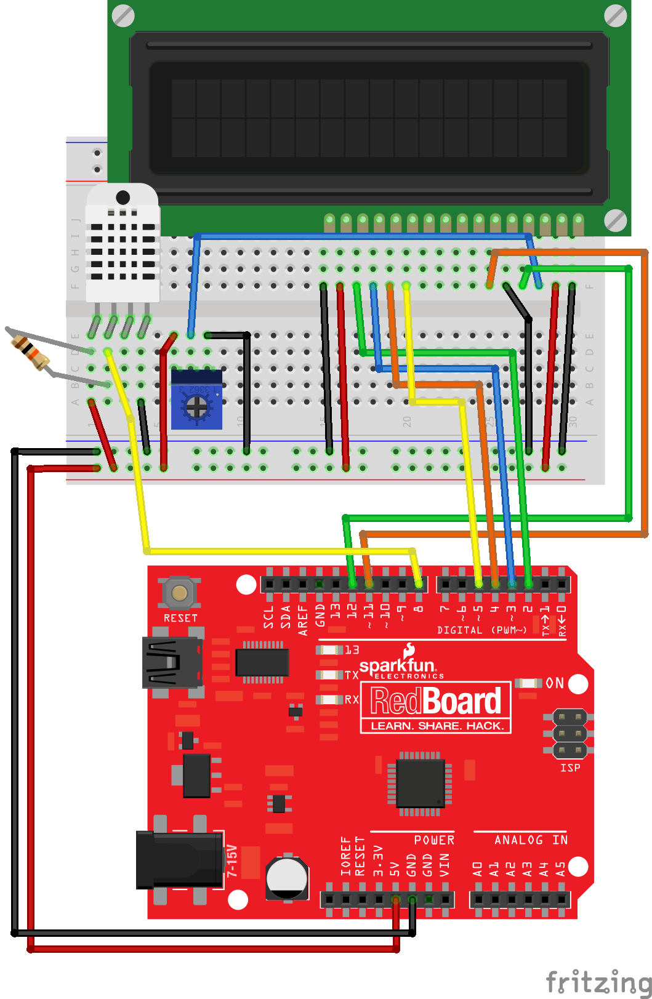

# ArduinoDHT22LCD
Arduino-based temperature/humidity sensor with LCD display

## Hardware required:

1. Arduino Uno or compatible (pictured: SparkFun Redboard)
2. DHT22 Temperature/Humidity sensor
3. Arudino-compatible 16x2 LCD (similar to https://www.sparkfun.com/products/9067)
4. Trimpot for adjusting LCD brightness (similar to https://www.sparkfun.com/products/9806)
5. A lot of wires

## Addtional library:

Adafruit DHT Sensor Library

https://github.com/adafruit/DHT-sensor-library

## Fritizing diagram

https://github.com/kellybs1/ArduinoDHT22LCD/blob/master/DHT22-LCD.fzz

